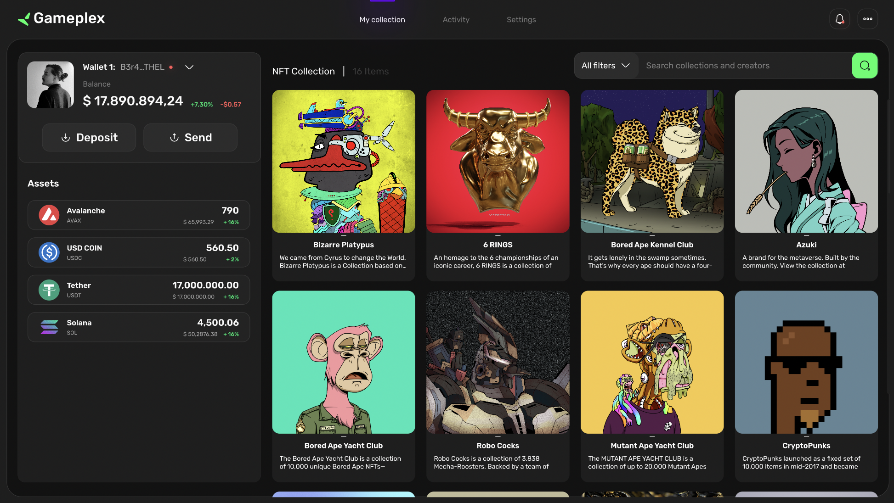

# Gameplex-Wallet

A Gaming Community Focused wallet with integrations with Unity and Unreal Engine. Uses a Secure backend infrastraucture to communicate with any application.

> __Note__ Gameplex Wallet Public Repo for Issues, Feedback and Releases 

